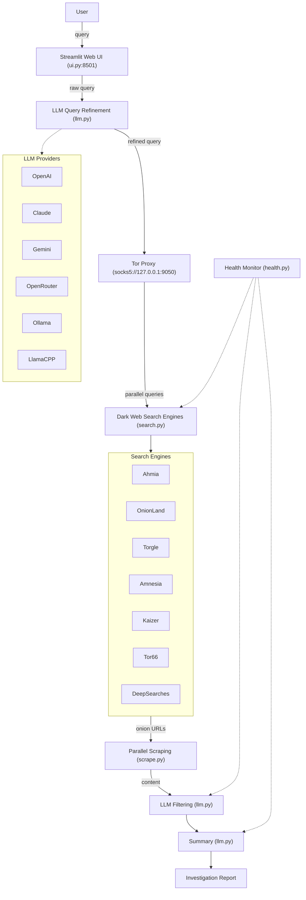

<div align="center">
   
   <br>
   <a href="https://github.com/confidentialwebapp/Transillience-Aegis/actions/workflows/docker-release.yml"></a>
   <a href="https://github.com/confidentialwebapp/Transillience-Aegis/releases"></a>
   <h1>Transillience Aegis: Dark Web OSINT Platform</h1>

   <p>Transillience Aegis is an AI-powered platform for conducting dark web OSINT investigations. It leverages LLMs to refine queries, filter search results from dark web search engines, and provide an investigation summary.</p>
   <a href="#installation">Installation</a> &bull; <a href="#usage">Usage</a> &bull; <a href="#contributing">Contributing</a> &bull; <a href="#acknowledgements">Acknowledgements</a><br><br>
</div>

## Architecture



---

## Features

- ⚙️ **Modular Architecture** – Clean separation between search, scrape, and LLM workflows.
- 🤖 **Multi-Model Support** – Easily switch between OpenAI, Claude, Gemini or local models like Ollama.
- 🌐 **Web UI** – Streamlit-based interface for interactive investigations.
- 🐳 **Docker-Ready** – Recommended Docker deployment for clean, isolated usage.
- 📝 **Custom Reporting** – Save investigation output to file for reporting or further analysis.
- 🧩 **Extensible** – Easy to plug in new search engines, models, or output formats.

---

## ⚠️ Disclaimer
> This tool is intended for educational and lawful investigative purposes only. Accessing or interacting with certain dark web content may be illegal depending on your jurisdiction. The author is not responsible for any misuse of this tool or the data gathered using it.
>
> Use responsibly and at your own risk. Ensure you comply with all relevant laws and institutional policies before conducting OSINT investigations.
>
> Additionally, Transillience Aegis leverages third-party APIs (including LLMs). Be cautious when sending potentially sensitive queries, and review the terms of service for any API or model provider you use.

## Installation
> [!NOTE]
> The tool needs Tor to do the searches. You can install Tor using `apt install tor` on Linux/Windows(WSL) or `brew install tor` on Mac. Once installed, confirm if Tor is running in the background.

> [!TIP]
> You can provide your LLM of choice API key by either creating .env file (refer to sample env file in the repo) or by setting env variables in PATH.
>
> For Ollama, provide `http://host.docker.internal:11434` as `OLLAMA_BASE_URL` in your env if running using docker method or `http://127.0.0.1:11434` for other methods. You might need to serve Ollama on 0.0.0.0 depending on your OS. You can do by running `OLLAMA_HOST=0.0.0.0 ollama serve &` in your terminal.

### Docker [Recommended]

- Pull the latest Transillience Aegis docker image
```bash
docker pull transillience-aegis:latest
```

- Run the docker image as:
```bash
docker run --rm \
   -v "$(pwd)/.env:/app/.env" \
   --add-host=host.docker.internal:host-gateway \
   -p 8501:8501 \
   transillience-aegis:latest
```

> [!TIP]
> To persist saved investigations across Docker restarts, mount a local directory:
> ```bash
> docker run --rm \
>    -v "$(pwd)/.env:/app/.env" \
>    -v "$(pwd)/investigations:/app/investigations" \
>    --add-host=host.docker.internal:host-gateway \
>    -p 8501:8501 \
>    transillience-aegis:latest
> ```
> Investigations are saved to the `investigations/` folder in your working directory and can be loaded from the **Past Investigations** panel in the sidebar.

- Open your browser and navigate to `http://localhost:8501`

### Using Python (Development Version)

- With `Python 3.10+` and Tor installed, run the following:

```bash
pip install -r requirements.txt
streamlit run ui.py
```

- Open your browser and navigate to `http://localhost:8501`

---

## Usage

1. Ensure Tor is running in the background (`tor &` or `service tor start`)
2. Launch the application using Docker or Python (see Installation)
3. Enter your dark web search query in the search box
4. The LLM will refine your query for optimal dark web searching
5. Results are scraped from multiple dark web search engines
6. Filtered and summarized results are displayed in the UI
7. Save investigations for future reference using the sidebar

---

## Contributing

Contributions are welcome! Please feel free to submit a Pull Request if you have major feature updates.

- Fork the repository
- Create your feature branch (git checkout -b feature/amazing-feature)
- Commit your changes (git commit -m 'Add some amazing feature')
- Push to the branch (git push origin feature/amazing-feature)
- Open a Pull Request

Open an Issue for any of these situations:
- If you spot a bug or bad code
- If you have a feature request idea
- If you have questions or doubts about usage
- If you have minor code changes

---

## Acknowledgements

- Idea inspiration from [Thomas Roccia](https://x.com/fr0gger_) and his demo of [Perplexity of the Dark Web](https://x.com/fr0gger_/status/1908051083068645558).
- Made by Transillience Aegis
- LLM Prompt inspiration from [OSINT-Assistant](https://github.com/AXRoux/OSINT-Assistant) repository.


