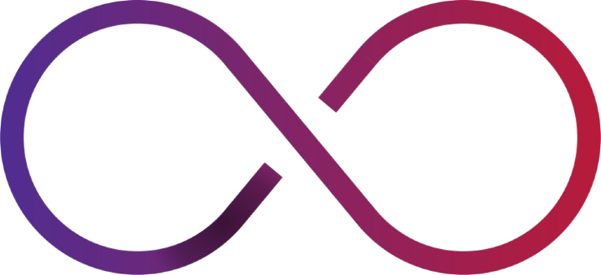
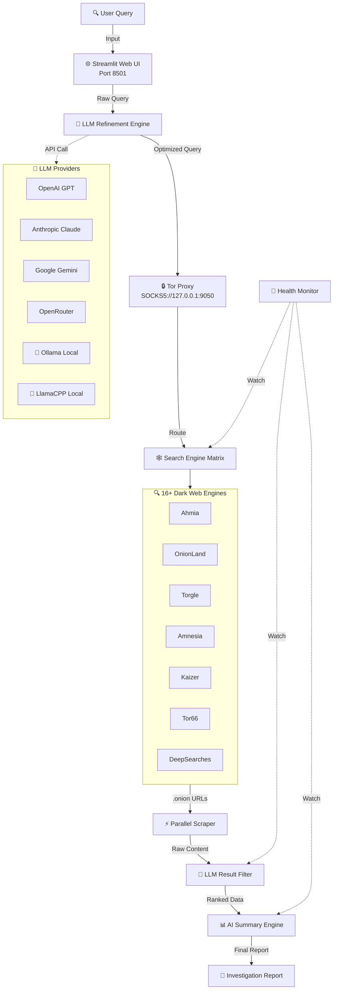

<div align="center">
   
   <!-- Animated Logo Effect -->
   
   
   <br><br>
   
   <!-- Epic Badges Row -->
   <a href="https://github.com/confidentialwebapp/Transillience-Aegis/actions/workflows/docker-release.yml">
      
   </a>
   <a href="https://github.com/confidentialwebapp/Transillience-Aegis/releases">
      
   </a>
   <a href="#">
      
   </a>
   <a href="#">
      
   </a>
   
   <br><br>
   
   <!-- Cool Title with Neon Effect -->
   <h1>
      
   </h1>
   
   <!-- Tagline -->
   <p align="center">
      <em>🔍 Illuminate the shadows. AI-powered dark web intelligence at your fingertips.</em>
   </p>
   
   <!-- Quick Navigation -->
   <a href="#features"></a>
   <a href="#architecture"></a>
   <a href="#quick-start"></a>
   <a href="#installation"></a>
   
   <br><br>
   
   <!-- Star Count (Visual) -->
   
   
</div>

<br>

<!-- Cool Divider -->


<br>

## 🌟 Features

<table>
<tr>
<td width="50%">

### 🤖 AI-Powered Intelligence
- **Smart Query Refinement** – LLMs optimize your search queries
- **Intelligent Filtering** – AI filters relevant results automatically  
- **Multi-Model Support** – OpenAI, Claude, Gemini, Ollama, LlamaCPP

</td>
<td width="50%">

### 🔒 Privacy & Security
- **Tor Integration** – Anonymous routing via SOCKS5 proxy
- **Local Processing** – Use Ollama/LlamaCPP for on-premise AI
- **Docker Isolation** – Clean, sandboxed deployment

</td>
</tr>
<tr>
<td width="50%">

### 🌐 Dark Web Coverage
- **16+ Search Engines** – Ahmia, OnionLand, Torgle, and more
- **Parallel Scraping** – High-speed onion site crawling
- **Real-time Results** – Live investigation dashboard

</td>
<td width="50%">

### 📝 Investigation Tools
- **Custom Reports** – Save investigations to file
- **History Tracking** – Revisit past searches anytime
- **Streamlit UI** – Modern, responsive web interface

</td>
</tr>
</table>

<br>

<!-- Cool Divider -->


<br>

## 🏗️ Architecture

<details>
<summary><b>🔥 Click to Expand System Architecture</b></summary>
<br>



</details>

<br>

<!-- Cool Divider -->


<br>

## � Quick Start

```bash
# 1. Clone the repository
git clone https://github.com/confidentialwebapp/Transillience-Aegis.git
cd Transillience-Aegis

# 2. Start Tor service
tor &

# 3. Launch with Docker (Recommended)
docker-compose up

# 4. Open browser → http://localhost:8501
```

<br>

<!-- Cool Divider -->


<br>

## 📦 Installation

### Prerequisites

> 🧅 **Tor Required**
> ```bash
> # Linux/WSL
> sudo apt install tor && sudo service tor start
> 
> # macOS
> brew install tor && brew services start tor
> ```

### 🐳 Docker (Recommended)

```bash
# Pull latest image
docker pull transillience-aegis:latest

# Run container
docker run --rm \
   -v "$(pwd)/.env:/app/.env" \
   --add-host=host.docker.internal:host-gateway \
   -p 8501:8501 \
   transillience-aegis:latest
```

<details>
<summary>💡 <b>Persistence Tip</b> (Click to expand)</summary>

```bash
# Save investigations across restarts
docker run --rm \
   -v "$(pwd)/.env:/app/.env" \
   -v "$(pwd)/investigations:/app/investigations" \
   --add-host=host.docker.internal:host-gateway \
   -p 8501:8501 \
   transillience-aegis:latest
```
</details>

### 🐍 Python Development

```bash
# Requirements: Python 3.10+
pip install -r requirements.txt

# Launch UI
streamlit run ui.py
```

<br>

<!-- Cool Divider -->


<br>

## 🎯 Usage Guide

| Step | Action | Result |
|------|--------|--------|
| 1 | 🔌 Ensure Tor is running | `service tor start` |
| 2 | 🚀 Launch application | Docker or `streamlit run ui.py` |
| 3 | 📝 Enter search query | Natural language input |
| 4 | 🤖 AI refines query | Optimized for dark web |
| 5 | 🕸️ Parallel search | 16+ engines queried |
| 6 | 📊 View filtered results | AI-ranked relevance |
| 7 | 💾 Save investigation | To `investigations/` folder |

<br>

<!-- Cool Divider -->


<br>

## ⚠️ Legal Disclaimer

> **🔒 For Educational & Lawful Use Only**
> 
> This tool is intended for **authorized OSINT investigations** and **cybersecurity research**. 
> 
> - ✅ Compliance with local laws is **your responsibility**
> - ✅ Institutional policies must be followed
> - ✅ API terms of service apply to LLM queries
> 
> <sub>By using this tool, you accept full responsibility for your actions. The authors assume no liability for misuse.</sub>

<br>

<!-- Cool Divider -->


<br>

## 🤝 Contributing

We welcome contributions! Follow these steps:

```bash
# 1. Fork the repo
# 2. Create feature branch
git checkout -b feature/amazing-feature

# 3. Commit changes
git commit -m "✨ Add amazing feature"

# 4. Push to branch
git push origin feature/amazing-feature

# 5. Open Pull Request 🎉
```

**Issues welcome for:**
- 🐛 Bug reports
- 💡 Feature requests  
- ❓ Usage questions
- 🔧 Minor improvements

<br>

<!-- Cool Divider -->


<br>

## 🙏 Acknowledgements

<table>
<tr>
<td>

**Inspiration**
- 💡 [Thomas Roccia](https://x.com/fr0gger_) – *Perplexity of the Dark Web* concept

**Resources**
- 📚 [OSINT-Assistant](https://github.com/AXRoux/OSINT-Assistant) – LLM prompts

</td>
<td align="right">

**Built by**
<br><br>

<br>
<b>Transillience Aegis</b>

</td>
</tr>
</table>

<br>

<div align="center">
   
   <!-- Footer -->
   
   
   <sub>🛡️ Illuminating the dark web, one query at a time.</sub>
   
</div>
