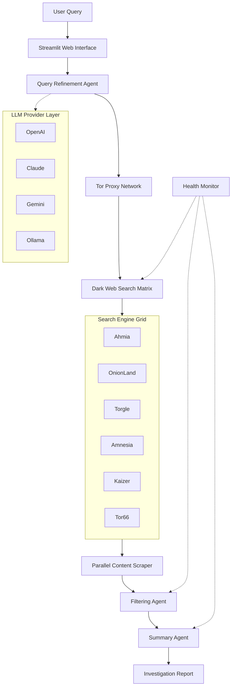

<div align="center">
   
   
   <h1>Transillience Aegis</h1>
   <p><strong>Managed Dark Web Intelligence & OSINT Platform</strong></p>
   
   <p>
      <a href="https://github.com/confidentialwebapp/Transillience-Aegis/actions/workflows/docker-release.yml">
         
      </a>
      <a href="https://github.com/confidentialwebapp/Transillience-Aegis/releases">
         
      </a>
      <a href="#">
         
      </a>
   </p>
   
   <p>
      <a href="#overview">Overview</a> ·
      <a href="#capabilities">Capabilities</a> ·
      <a href="#getting-started">Getting Started</a> ·
      <a href="#documentation">Documentation</a>
   </p>
</div>

---

## Overview

Transillience Aegis is an enterprise-grade OSINT platform that leverages AI agents to autonomously conduct dark web investigations. The platform combines large language models with anonymized Tor routing to deliver actionable intelligence from hidden services.

**One platform across:**
- Dark Web Search & Discovery
- Automated Content Analysis
- LLM-Powered Intelligence Summaries
- Continuous Investigation Monitoring

---

## Capabilities

### AI-Powered Investigation Agents
| Agent | Function |
|-------|----------|
| **Query Refinement Agent** | Optimizes natural language queries for dark web search engines |
| **Content Filtering Agent** | LLM-based relevance scoring and noise reduction |
| **Intelligence Summary Agent** | Generates actionable investigation reports |
| **Health Monitor Agent** | Continuous system and search engine availability monitoring |

### Supported LLM Providers
- OpenAI GPT-4
- Anthropic Claude
- Google Gemini
- OpenRouter
- Ollama (Local)
- LlamaCPP (Local)

### Dark Web Coverage
16+ integrated search engines including Ahmia, OnionLand, Torgle, Amnesia, Kaizer, and Tor66.

---

## System Architecture



---

## Getting Started

### Prerequisites

**Tor Service Required**
```bash
# Ubuntu/Debian/WSL
sudo apt install tor
sudo service tor start

# macOS
brew install tor
brew services start tor
```

### Deployment Options

**Docker (Recommended)**
```bash
# Pull and run
docker pull transillience-aegis:latest

docker run --rm \
   -v "$(pwd)/.env:/app/.env" \
   -p 8501:8501 \
   transillience-aegis:latest
```

**With Persistent Storage**
```bash
docker run --rm \
   -v "$(pwd)/.env:/app/.env" \
   -v "$(pwd)/investigations:/app/investigations" \
   -p 8501:8501 \
   transillience-aegis:latest
```

**Python Development**
```bash
pip install -r requirements.txt
streamlit run ui.py
```

Access the interface at: `http://localhost:8501`

---

## Configuration

Create a `.env` file with your LLM API keys:

```env
OPENAI_API_KEY=your_key_here
ANTHROPIC_API_KEY=your_key_here
GEMINI_API_KEY=your_key_here

# For local models
OLLAMA_BASE_URL=http://127.0.0.1:11434
```

---

## Usage Workflow

1. **Initialize** – Ensure Tor service is active
2. **Query** – Enter investigation target in natural language
3. **Refinement** – AI agent optimizes query for dark web context
4. **Discovery** – Parallel search across 16+ engines
5. **Analysis** – Content scraped and filtered by relevance
6. **Reporting** – Intelligence summary generated automatically
7. **Persistence** – Investigation saved for audit trail

---

## Legal Notice

> **Authorized Use Only**
> 
> This platform is intended for lawful OSINT investigations, cybersecurity research, and authorized security assessments. Users are responsible for compliance with all applicable laws and institutional policies.
> 
> - Verify authorization before conducting investigations
> - Adhere to local jurisdiction regulations
> - Review API provider terms of service for LLM queries
> 
> By using Transillience Aegis, you acknowledge full responsibility for lawful use.

---

## Documentation

- [Installation Guide](#getting-started)
- [Configuration Reference](#configuration)
- [Architecture Overview](#system-architecture)

---

## Contributing

Contributions are welcome for platform enhancement:

```bash
# Fork repository
git checkout -b feature/description
git commit -m "Add feature description"
git push origin feature/description
# Open Pull Request
```

---

## Resources

- **Inspiration**: [Thomas Roccia](https://x.com/fr0gger_) – Perplexity of the Dark Web
- **Acknowledgements**: [OSINT-Assistant](https://github.com/AXRoux/OSINT-Assistant) – LLM prompt methodology

---

<div align="center">
   <sub>Transillience Aegis – Enterprise Dark Web Intelligence</sub>
</div>
